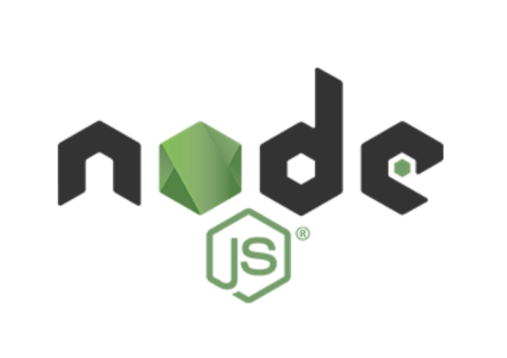
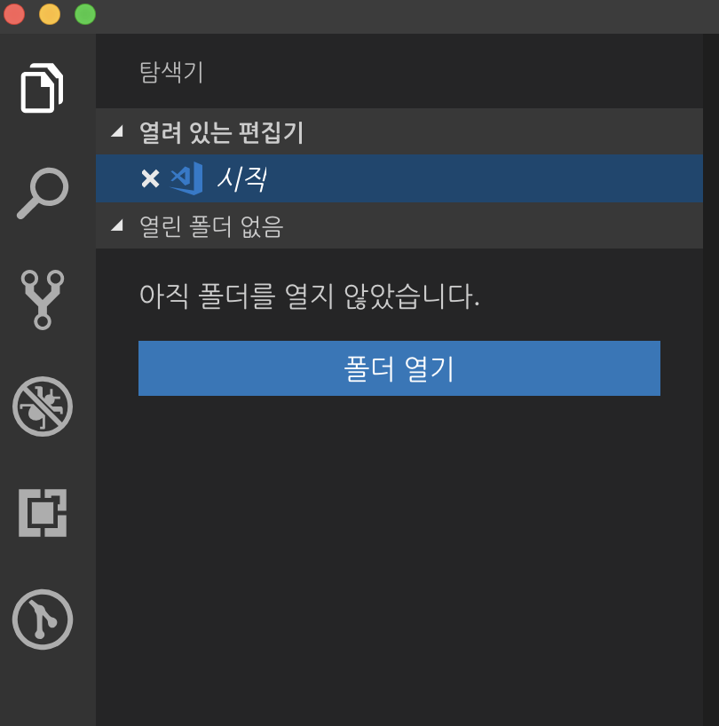
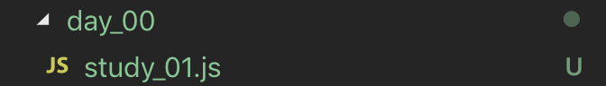
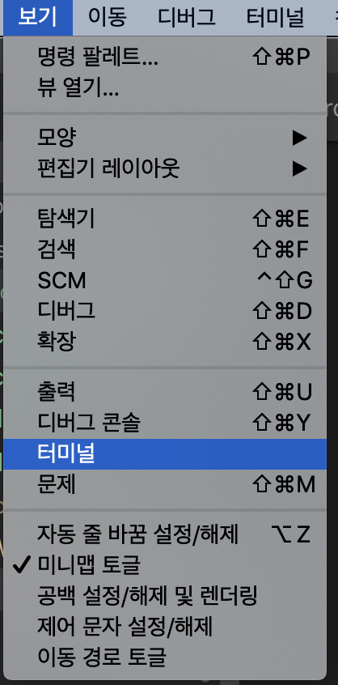
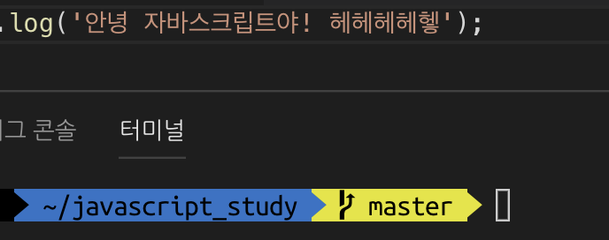
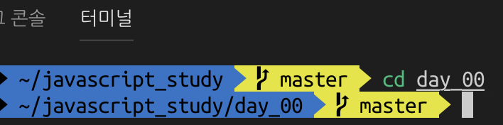
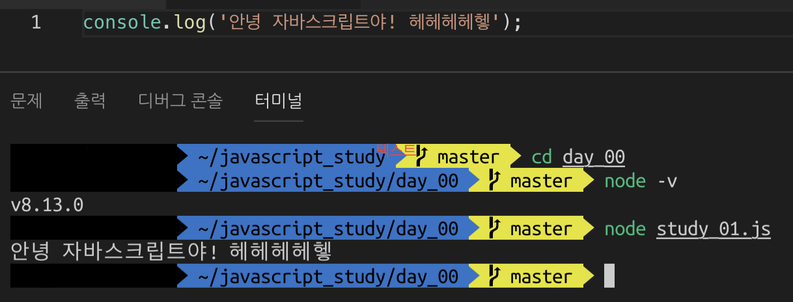

## 자바스크립트는? (사실 나도 이거 쓰면서 처음알았음 그냥 몰라도 괜찮아 헤헿)
~~~
JavaScript는 1995년 Netscape의 엔지니어 Brendan Eich에 의해 만들어졌고,
이른 1996년에 Netscape 2와 함께 처음 릴리즈 되었습니다. 이것은 원래 LiveScript로 불리기로 되어 있었습니다.
하지만 Sun Microsystem의 Java 언어의 성공에 편승해보려고 -두 언어 사이의 공통점이 매우 적음에도 불구하고-
불행이 예견된 마케팅 결정에 따라 이름이 바뀌게 됩니다. 이 결정은 역사상 유래가 없는 혼란의 근원이 되어버립니다.

몇 달 후, Microsoft는 IE3와 함께 JScript를 발표했습니다.
이 JScript는 Javascript를 정말 닮았고 호환성이 좋았습니다.
몇 달 뒤에, Netscape는 1997년에 ECMAScript 표준의 첫번째 판이 되는 JavaScript를 유럽 표준화 단체인 Ecma International에 보냅니다.
이 표준은 1999년에 ECMAScript edition 3에 따라 큰 규모의 개정을 거친 후, 유례없이 아주 안정된 상태로 계속 유지되고 있습니다.
4번째 판은 중도 포기되었는데, 언어의 복잡성 증가에 관련한 정치적 문제 때문이었습니다.

출처 - https://developer.mozilla.org/ko/docs/A_re-introduction_to_JavaScript
~~~

자바스크립트는 사실 자바와 완전하게 다른 언어이며, HTML과 함께 인터넷 브라우저에서 발생하는 여러 가지 이벤트를 핸들링하는데 주로 사용되는 언어이다. 
훌륭한 프레임워크인 NodeJS가 나온 이후로 웹뿐만 아니라 응용프로그램, 모바일 애플리케이션 등을 개발하는 데에 사용되기도 하며 클라이언트뿐 아니라 서버 랭귀지로도 사용된다. 
C언어와 기초 문법이 비슷하며 자바스크립트의 버전이 올라갈수록 언어를 사용하는데 편리한 기능이 점차 탑재되어가고 있다. 
개발을 처음 하는 데에 C, JAVA 등의 언어보다 입문이 쉽지만 앞의 언어와 엄연히 다른 목적으로 만들어진 언어이기 때문에 결코 쉬운 언어는 아니다. 
하지만 현재는 자바스크립트를 배움으로써 여러 플랫폼의 개발을 진행할 수 있어 굉장히 메리트 있는 언어다. 
 

## 설치부터 시작하기
자바스크립트를 시작하기 전 언어를 배우는데 도움이 되는(**현업에서도 사용하는**) 프로그램을 먼저 설치해야한다.

#### 1. VSCode

 
https://code.visualstudio.com/  
위의 주소로 들어가 본인의 환경에 맞는 VSCode를 다운로드하자. 
VSCode는 자바스크립트를 개발하기 좋은 에디터(**IDE : Integrated Development Environment**) 이며 무료로 배포되는 프로그램이라 현업에서도 많은 회사에서 사용하고 있다. 
WebStorm, Atom 등의 유료 에디터도 있으나 어느 정도 개발이 익숙해지면 결제 또는 커뮤니티 버전을 사용해보도록 하자.

#### 2. NodeJS

 
https://nodejs.org/  
위의 주소에서 LTS 버전을 다운로드하자.  
NodeJS는 구글의 V8 엔진을 사용하여 자바스크립트로 서버 개발을 할 수 있게 해주는 엄청난 프레임워크이다.  
노드로 인하여 자바스크립트 언어 하나만 배워도 프론트엔드, 백엔드, 웹을 떠나 그 외에 응용프로그램 등을 개발할 수 있다.  
LTS 버전과 Current 버전이 있는데, LTS 버전은 개발에 최적화된 버전이고 Current 버전은 기능 개선에 초점을 맞춘 최신 버전으로, 업데이트가 잦다.  
현재 현업에서는 8.x 버전을 가장 많이 사용하며, NVM(**Node Version Manager**)을 설치하여 한 컴퓨터에서 여러 가지 노드 버전을 사용할 수 있지만 우선 안정화된 버전에서 자바스크립트를 배우기로 한다.  
NodeJS를 설치한다고 절대 NodeJS를 배우는 것이 아니다. 이를 설치하는 것은 자바스크립트를 더욱 쉽게 실행하기 위함이다.  
 

## 코드 작성하기
우선 원하는 위치에 원하는 이름으로 폴더를 생성한다.  
그다음 VSCode를 실행하여 해당 폴더를 불러온다.  
VSCode 를 처음 실행하면 예제 사진과 달리 영문이 여러분을 반겨줄 것이다.  
한글은 어디 있지!? 하며 당황하지 말고 침착하자.  
나는 개발 조무사라 한국어 팩을 설치하여 사용하지만, 여러분은 개발자가 되어야 하니까 영어를 잘하는척해야 한다.  
사실 버튼 위치는 똑같으니 주변에서 ***'오... 영어 잘하는 개발자인가 보다!'*** 라고 생각하기 위해 여러분은 그냥 영어 버전을 쓰도록 하자.  
 

 
그저 여러분은 폴더를 불러왔을 뿐인데 훌륭하게 자바스크립트 프로젝트를 생성하였다.  
이제 여러분의 프로젝트에 day\_00 폴더를 만들고 그 안에 study\_01.js 파일을 생성해보자.  
 

 

이제 study\_01.js 파일에 밑의 예제 코드를 작성한다.
~~~js
console.log('안녕 자바스크립트야! 헤헤헤헤헿');
~~~
꼭 작성 후 저장을 눌러야 한다 이제부터 저장 버튼 단축키를 습관화 하자 (**window control+S, Mac command+S**)  
**주위의 다른 개발자가 당신을 위협한다면 재빨리 저장하고 회사의 두꺼비집을 내려 상대방을 공격하도록 하자!**  
 
자바스크립트에서 ***console.log()*** 함수는  
C언어의 ***printf()***, JAVA의 ***System.out.println()*** 함수와 비슷하게 콘솔 창에 ***문자열을 출력*** 해주는 기능을 한다.  
이제 VSCode에서 상단의 (**보기 > 터미널**)을 눌러 위의 코드를 실행할 준비를 한다.  
단축키는 (***control+`***)  
 

 
터미널을 사용할 줄 아는 사람들은 본인이 사용하던것을 사용하는것이 좋다.  
VSCode의 장점은 터미널을 열었을 때 현재 작업하고 있는 프로젝트의 경로에 자동으로 들어가진다.  
 

 
터미널의 화면은 예제 사진과 다를것이다. 신경쓰지 않고 cd day\_00 을 입력하여 작업중인 폴더로 이동한다.  
 

 
**cd** 명령어는 ***Change Directory*** 의 약자로 명령한 폴더로 이동하는 기능이며,  
이전 폴더로 돌아가기(***뒤로가기***) 위해서는 **cd ..** 을 입력하면 된다.  
만약 방금 **cd ..** 을 입력했다면 다시 **cd day\_00**을 입력해서 study\_01.js 파일이 있는 폴더로 이동하자!  
 

 
NodeJS가 잘 설치되었는지 확인하기 위해서 터미널에 **node -v** 를 입력하고 설치된 버전을 확인한다.  
설치한 버전에 따라 예제와 다른 버전을 보여준다.  
그다음 우리가 만든 **study\_01.js** 를 실행하기 위해 **node study\_01.js** 를 입력한다.  
본인이 작성한 코드가 제대로 출력되었다면 여러분은 자바스크립트를 절반 이상 배운 것이니 ***이력서에 자바스크립트를 써도 좋다.***

###모든 예제 코드는 https://github.com/smokerJS/javascript_study 에서 무료로 열람이 가능합니다! 세상에나!