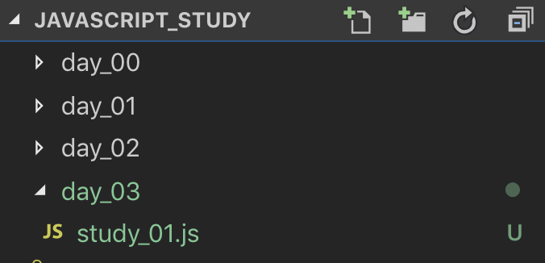

## 자바스크립트 ES6의 변수
저번 시간에는 **ES6** 이전 사용되던 **var** 키워드에 대하여 알아보았다. \
**ES6**에서는 **var** 키워드에 대한 문제점과 불편함을 개선한 **let**, **const** 변수 키워드를 사용할 수 있게 되었다. \
**var** 키워드에 비하여 비교적 간단한 특징을 갖고 있는 **let**, **const** 키워드를 알아보자! \
 

## 블록레벨 지역변수 let
**let** 키워드의 사용방법은 **var** 키워드와 다르지 않다. \
자바스크립트에서 **일반적인 변수 선언 키워드**라고 생각하면 이해가 빠르다. \
선언 이후 값을 바꿀 수 있으며, **var** 키워드와 다르게 **선언 이전에 참조가 불가능**하다. \
 

 

VSCode를 열어 여러분의 프로젝트에 **day_03** 폴더를 만들고 **study\_01.js** 파일을 생성하자. \
**let** 키워드를 사용하는 코드를 **study\_01.js** 에 작성하여보자.
~~~javascript
let test = 1;
console.log(test);
test = 2;
console.log(test);
~~~
위의 코드는 **let** 키워드를 사용하여 **test** 라는 이름의 변수를 선언하고 **1**이라는 값을 변수에 할당하는 코드이다. \
이후, 변수의 값을 **2**로 바꿔 서로 한 번씩 출력을 한다. \
코드를 실행해보자!
~~~console
node study_01.js
1
2
~~~
 

이번에는 **고의적으로 에러를 내는 코드를 작성해보겠다.** \
**study\_02.js** 를 만들고 밑의 코드를 작성해보자!
~~~javascript
let test = 1;
console.log(test);
let test = 2;
console.log(test);
~~~
**let** 키워드를 사용하여 같은 이름의 **변수를 두 번 선언**하였다. \
코드를 실행해보자!
~~~console
node study_02.js
.../javascript_study/day_03/study_02.js:3
let test = 2;
    ^
SyntaxError: Identifier 'test' has already been declared
~~~
위와 같이 에러가 나왔다면 여러분이 예제를 제대로 작성한 게 맞다! \
저번 시간 **var** 키워드로 같은 이름의 변수를 두 번 선언했을 때는 에러가 나오지 않았지만, **let** 키워드는 **같은 이름의 변수를 중복 선언할 수 없다!** \
즉, 이미 선언된 변수의 값을 바꾸기 위해서는 **study\_01.js** 처럼 키워드를 선언하지 않고 **변수명을 선언한 뒤, 값을 할당**하면 된다! \
 

**이번에도 고의적으로 에러를 내는 코드를 작성해보자!** \
에러가 난다고 무서워하면 안 된다! 이제부터 여러분은 **수많은 에러 메세지와 함께하게 될 것이다!** \
한 번에 성공하는 개발자는 분명 실력이 있지만, 많은 에러를 만나고 그에 대한 대처법을 알고 있는 개발자가 훨씬 훌륭한 개발자다! \
**study\_03.js** 를 만들고 밑의 코드를 작성해보자!
~~~javascript
console.log(test);

let test = 1;
~~~
우린 저번 시간에 자바스크립트의 **호이스팅**(***hoisting***)에 관하여 공부하였다! \
**var** 키워드로 선언한 변수는 **호이스팅**으로 인하여 값을 할당하기 전에 **호출**(***참조***)이 가능하였다. \
하지만 그 값은 값이 없다는 의미인 **undefined** 가 나왔었는데, **let** 키워드는 어떨지 실행해보자!

~~~console
node study_03.js
.../javascript_study/day_03/study_03.js:1
(function (exports, require, module, __filename, __dirname) { console.log(test);
                                                                          ^

ReferenceError: test is not defined
~~~
위와 같은 에러가 나왔다면 이번에도 예제를 잘 따라 한 것이 맞다! \
**var** 키워드로 선언한 변수는 선언하기 전에도 호출이 가능했는데, **let** 키워드로 선언한 변수는 **찾을 수 없다는 에러**가 나왔다! \
그렇다면 **let** 키워드로 선언한 변수는 **호이스팅** 대상이 아닌 것일까? \
 

### 일시적 사각지대 (Temporal dead zone)
자바스크립트는 변수 선언의 호이스팅(***hoisting***) 이라는 특징이 있다. \
위의 예제에서 **let** 키워드로 선언한 변수는 **선언 이전에 호출이 불가능**하였다. \
언뜻 보면 **let** 은 호이스팅 대상이 아닌 듯 보이지만, 사실 **let** 키워드의 변수도 **호이스팅 대상**에 포함된다. \
**study\_03.js** 의 코드는 사실 이러한 형태로 되어있다.

~~~javascript
let test;

console.log(test);

test = 1;
~~~
이미 **test** 라는 변수는 호이스팅으로 인하여 코드 최상단(**블록의 최상단**)에 선언이 되어있는 형태이다. \
하지만 **test = 1;** 이라는 구문이 나오기 전까지 **test** 라는 **변수를 호출할 수 없다.** \
이것은 **일시적 사각지대** 라는 이유 때문인데 호이스팅으로 인하여 변수는 **이미 선언이 되어있는 상태**이지만, \
실제 **선언 구문이 나오기 전까지는 변수를 사용할 수 없음**을 뜻한다.
~~~javascript
let test; // 호이스팅으로 인하여 블록 최상단에 변수 선언
// ------- 일시적 사각지대 -------
console.log(test); // ------- 변수 사용 불가능 : test is not defined 에러 발생 -------

// ------- 일시적 사각지대 -------
test = 1; /// ------ 이후 구문부터 변수 사용 가능 -------
~~~
일시적 사각지대는 **var** 키워드의 선언 이전 참조 가능한 특징의 **설계 오류를 막기 위하여 등장**하였으며, \
**let**과 밑에서 배울 **const** 키워드 둘 다 **적용**되는 특징이다. \
 

**let** 키워드로 변수를 선언하고, **값을 할당하지 않으면 과연 어떤 값이 반환될까?** \
**study\_04.js** 를 만들고 밑의 코드를 작성한 뒤 실행하여보자!
~~~javascript
let test;

console.log(test);
~~~
~~~console
node study_04.js
undefined
~~~
변수를 선언하고 **값을 할당하지 않으면**, 자바스크립트에서는 **undefined** 가 반환된다. \
**변수는 선언과 동시에 값을 할당하는 것이 가장 바람직**하며 이를 **변수의 초기화**라고 부른다. \
변수를 초기화하지 않을 경우 **다른 언어**에서는 **초기화하지 않은 변수를 호출할 시**에 **에러**가 발생하지만, \
자바스크립트는 값이 없다는 **undefined**를 반환하여 **좀 더 유연한 프로그래밍**이 가능하다. 하지만 **되도록 변수의 값을 초기화**하는 게 좋은 편이다.
~~~javascript
let number = 0;
let string = '';
~~~
여러분은 문자와 숫자를 배웠기 때문에 아직 **값을 할당하지 않을 변수를 선언할 때엔 저렇게 각 자료형의 기본 형태**로 **초기화**하는 것이 바람직하다. \
이는 **let** 키워드에 **한정**되며 **let** 키워드는 **값이 계속 변할 수 있는 변수**를 선언할 때 사용되기 때문이다. \
위처럼 자료형의 기본 형태로 초기화한다면, 뒤의 코드를 읽지 않아도 해당 **변수에 어떤 형태의 값이 담길지 예상이 가능하다!**

C, Java는 변수를 선언할 때 어떠한 값이 담길지 변수의 타입을 선언해야 하지만, **자바스크립트는 언제든 변수의 자료형이 바뀌어도 에러가 나지 않는다!** \
**동적 타입 할당**이라는 특징 때문인데, 굉장히 편리한 기능인 동시에 **코드가 복잡해질 가능성이 있어 주의**해야 한다! \
 

### 블록레벨 변수
**var** 키워드는 함수레벨 변수였지만, **let**과 **const**는 블록 레벨의 변수이다. \
**study\_05.js** 를 만들고 밑의 코드를 작성하여보자!
~~~javascript
var test1 = '1';
console.log(test1);
{
  var test1 = '2';
  console.log(test1);
}
console.log(test1);

console.log('------------');

let test2 = '1';
console.log(test2);
{
  let test2 = '2';
  console.log(test2);
}
console.log(test2);
~~~
코드를 실행하기 전, 결과가 어떻게 출력될지 예상하여보자! \
**var** 키워드는 함수레벨 키워드이기 때문에 블록 내부에서 다시 선언할 경우 블록 밖의 값도 바뀌게 될 것이다! \
이는 저번 시간에 배워 여러분도 알고 있을 것이다! \
그렇다면 1 2 2 가 출력이 될 것이다! \
그렇다면 블록레벨 키워드인 **let**은 어떨까? \
**let** 키워드는 **같은 변수명으로 중복 선언이 불가능**하다는 것을 위에서 배웠다! \
그렇다면 이번에도 에러가 나올까? 한번 실행해보자!
~~~console
node study_05.js
1
2
2
------------
1
2
1
~~~
놀랍게도 에러가 나오지 않고 잘 실행되었다! \
같은 변수 명의 변수를 두 번 선언하였는데 왜 에러가 나오지 않았을까? \
그것은 **let** 키워드가 블록레벨의 변수이기 때문이다! \
**let test2 = '1'** 을 선언하고 호출한 뒤 다시 **let test2 = '2'**를 선언하였을 때 \
이미 선언 구문이 **처음 선언했던 구문과 다른 블록**이 되어 **재 선언**이 가능하였고 그 값은 2가 출력되었다. \
블록을 탈출한 이후 다시 **test2**를 호출하였을 땐 **var** 키워드처럼 값이 유지되지 않고 **처음 블록에서 값을 할당한 1**이 출력되었다. \
이처럼 **let** 키워드는 **같은 레벨의 블록에서는 하위 레벨의 블록에서 재 선언 하더라도 변수의 값이 유지**되는 것을 알 수 있다!

그럼 블록 밖에 변수를 미리 선언해놓지 않는다면 블록 내부의 변수가 호출될까? \
**study\_06.js**를 만들고 밑의 코드를 작성하여보자!
~~~javascript
{
  var test1 = 'test1';
  console.log(test1);
}
console.log(test1);

console.log('------------');

{
  let test2 = 'test2';
  console.log(test2);
}
console.log(test2);
~~~
위의 코드의 실행 결과를 예상해보자! \
**var** 키워드는 함수 내부에서 선언된 게 아닌 이상, 블록을 벗어나도 변수가 유지되는 것을 여러분들은 이미 알고 있을 것이다! \
그럼 **let** 키워드는 어떨지 실행해보자!
~~~console
node study_06.js
test1
test1
------------
test2
.../javascript_study/day_03/study_06.js:13
console.log(test2)
            ^
ReferenceError: test2 is not defined
~~~
블록 내부의 **test2**는 정상적으로 출력이 되었지만, 블록을 벗어나면 블록 내부의 변수를 찾을 수 없다며 에러가 나온다! \
즉, **let** 키워드는 **블록단위로 블록의 범위 내에서만 유효한 변수**선언 키워드인 것이다! \
 

그렇다면 블록 내부에서 외부의 **let** 변수를 호출할 수 있을까?
**study\_07.js**를 만들고 밑의 코드를 작성하여보자!
~~~javascript
let test = 'test';
console.log(test);  // 1
{
  console.log(test);  // 2
  test = 'test2';
  console.log(test);  // 3
  {
    console.log(test);  // 4
    test = 'test3';
    console.log(test);  // 5
  }
}
console.log(test); // 6
~~~

전역에 **let** 키워드로 **test** 를 선언하고, 문자열 'test'를 할당하였다! \
과연 블록 내부에서 상위 블록의 **test**를 호출할 수 있을까? \
또, 블록을 빠져나왔을 때 **test**의 값은 어떤지 실행해보자!

~~~console
node study_07.js
test
test
test2
test2
test3
test3
~~~
사실 너무나 당연한 결과지만, 프로그래밍을 처음 배우는 여러분들을 위해 간단히 설명하자면 \
상위 블록에서 선언된 변수는 하위 블록에서 **재 선언하지 않고 변수명을 호출할 경우 상위 블록의 변수를 호출하게 된다!** \
하지만 **하위 블록에서 선언된 변수**는 위에서 배운 **study\_06.js** 의 예제처럼 블록을 탈출한 뒤 **상위 블록**에서 **호출할 수 없다!**

**var** 키워드로 선언된 변수는 위의 예제와 다른 동작을 하지만, **let** 키워드로 선언된 변수는 위처럼 동작하는 것을 이해해야 한다! \
이로 인하여 다른 언어와 달리 기존 자바스크립트에서 프로그램을 설계할 때 굉장히 주의 깊은 변수 선언이 필요하였으나, \
**ES6 이후부터는 간단하게 변수를 선언하고 사용할 수 있게 되었다!** \
 

### 반복문 이후 index가 되는 변수의 호출
여러분은 아직 반복문이라는 문법을 배우지 않았다! \
추후 배울 예정이니 **let** 키워드와 **var** 키워드의 차이가 어떤 것인지 보도록 하자! \
**study\_08.js** 파일을 만들고 밑의 예제를 작성한 뒤 실행해보자!
~~~javascript
for(var index1 = 0 ; index1 < 3 ; index1++){}
for(let index2 = 0 ; index2 < 3 ; index2++){}

console.log(index1);
console.log(index2);
~~~
~~~console
node study_08.js
3
.../javascript_study/day_03/study_08.js:5
console.log(index2);
            ^
ReferenceError: index2 is not defined
~~~
위의 예제는 **var**와 **let** 키워드를 이용하여 반복문의 인덱스를 선언하였고, 0부터 3까지 증가시킨 예제이다. \
실행 시 **var** 로 선언한 **index1** 변수는 반복문을 탈출한 뒤에도 변수가 사라지지 않고 호출할 수 있지만, \
**let** 으로 선언한 **index2** 변수는 **반복문 블록**을 탈출하자마자 변수가 유지되지 않고 사라졌다!

이처럼 기존 **ES5**까지는 **반복문 탈출 이후 사용하지 않는 인덱스로 선언된 변수를 호출할 수 있어 문제**가 있었으나, \
**ES6** 이후부터는 **let**으로 선언하여 **사용하지 않는 변수를 블록이 탈출하면 유지되지 않게 하여 더욱 깔끔한 프로그래밍**을 할 수 있게 되었다! \
반복문은 뒤에 나올 강의에서 배울 예정이니 저러한 형식의 문법이 있다는 것만 알고 넘어가도록 하자! \
 

## 변하지 않는 상수 const
**const** 키워드는 **블록레벨**, **같은 블록에서 재 선언 불가** 등의 특징이 **let**과 동일하다! \
**let** 키워드와 다른점은 **const** 키워드로 선언한 **변수는 값을 바꾸지 못하는 것이다!** (**재 할당 불가**) \
**값이 바뀌지 않고 계속 유지**되는 변수를 **상수**라고 표현하며, \
자바스크립트에서 **const**로 선언한 변수는 **반드시 선언과 동시에 값을 할당하여 변수를 초기화해야 한다.**

**study\_09.js** 를 만들고 밑의 예제를 작성해보자!
~~~javascript
const test1 = 10;
let test2 = 20;

console.log(test1);
console.log(test2);

test1 = test1 + 1;
test2 = test2 + 1;

console.log(test1);
console.log(test2);
~~~
**const** 키워드로 **test1** 변수에 10을 할당하였고, \
**let** 키워드로 **test2** 변수에 20을 할당한 뒤 출력하였다. \
이후 각 변수의 값을 1씩 증가시켜 다시 출력하는 프로그램이다!
~~~console
node study_09.js
10
20
.../javascript_study/day_03/study_09.js:7
test1 = test1 + 1;
      ^
TypeError: Assignment to constant variable.
~~~
예상대로 에러가 나왔다! \
10과 20이 정상적으로 출력되었고, 그 이후 **const** 로 선언된 **test1** 변수의 값을 바꿀 때 에러가 발생한 것이다. \
위처럼 **const** 변수는 값이 재할당 되지 않고 처음 값을 그대로 보호받는다! \
만약 변수를 선언하고, 그 이후 **값이 변하지 않는다면** **let** 키워드보다 **const** 키워드를 **사용하는 것이 적합**하다! \
 

Java에서는 이러한 상수를 선언할 때 **final** 키워드를 붙이며 **변수명을 전부 대문자로 선언**한다! \
이는 변하지 않는 **상수**라는 의미이며 다른 개발자가 여러분의 **코드를 수정할 때 상수를 건들지 않도록** 하는 효과가 있다! \
자바스크립트는 **const** 키워드만 있으면 **손쉽게 상수 선언이 가능**한 것이다! \
상수를 대문자로 선언하면 **가독성이 높아지는 효과**가 있으니 여러분도 **const** 키워드로 상수를 나타낼 때 **대문자를 이용**하도록 하자!
~~~javascript
const MIN_NUMBER_1 = 10;
const MAX_NUMBER_1 = 10;
let minNumber2 = 10;
let maxNumber2 = 10;
~~~
이처럼 대문자로 선언하고 단어가 이어지는 부분을 **_**(언더바) 로 표기하면 누구든지 **해당 변수가 상수**라는 것을 알 수 있다!

**let** 키워드에서 설명하지 않았으나 보통 **자바스크립트의 변수명은 소문자로 시작하고 단어가 이어지는 부분을 대문자로** 표기한다. \
(**카멜 표기법**(***Camel case***)) \
 

## const 키워드는 Object, Array의 property를 보호하지 않는다!
여러분은 지금까지 숫자와, 문자 타입을 배웠지만 자바스크립트에는 **객체(Object)**와 **배열(Array)** 타입도 존재한다! \
**const** 키워드로 객체와 배열을 선언할 경우 그 내부 값은 보장받지 못한다. \
추후 다시 배우겠지만 객체 타입과 배열 타입의 선언 방법을 알아보자!
~~~javascript
const arr = [1,2,3];
// 배열 : [] 로 감싸며 내부 값을 , 로 분리한다.

const obj = {a:'테스트1',b:'테스트2'};
// 객체 : {} 로 감싸며 key 와 value 가 한 쌍이고 내부 값을 , 로 분리한다.
~~~
**const** 키워드로 선언할 경우 **재 선언이 불가능**하며, **변수의 값이 보장**되지만 **객체와 배열의 내부 값은 보장받지 못한다!** \
이게 무슨 말이냐면 **arr** 변수는 최초 초기화된 **배열을 담는 공간**을 **기억**하고 있지만 그 내부의 값이 바뀌어도 에러가 나지 않으며, \
**obj** 변수 또한 최초 초기화된 **객체를 담는 공간**을 기억하고 있지만 그 내부가 변경되어도 아무 문제 없이 프로그램이 돌아간다. \
 

**study\_10.js** 을 생성하고 밑의 코드를 작성하고 실행하여보자!
~~~javascript
const arr = [1,2,3];
const obj = {a:'테스트1',b:'테스트2'};
console.log(arr);
console.log(obj);

console.log('------------');

arr.push(4);
obj.c = '테스트3';
console.log(arr);
console.log(obj);
~~~
~~~console
node study_10.js
[ 1, 2, 3 ]
{ a: '테스트1', b: '테스트2' }
------------
[ 1, 2, 3, 4 ]
{ a: '테스트1', b: '테스트2', c: '테스트3' }
~~~
위의 코드는 **arr** 배열의 마지막 공간에 **4를 넣고**, **obj** 객체의 **c 키값에 '테스트3'** 을 할당한 것이다. \
아직 여러분이 이해할 수 없는 문법이니 **const** 로 선언을 하여도 배열과 객체 내부의 값이 바뀔 수 있다는 것만 알아두자!

하지만 배열과 객체를 재할당하거나, 다른 값으로 바꾸는 것은 불가능하다! \
**study\_11.js** 를 생성하고 밑의 예제를 작성하자!
~~~javascript
const arr1 = ['a','b'];
const obj1 = {a:1,b:2};
let arr2 = ['a','b'];
let obj2 = {a:1,b:2};

console.log(arr1);
console.log(obj1);
console.log(arr2);
console.log(obj2);

console.log('------------');

arr2 = 30;
obj2 = 25;
console.log(arr2,obj2);

console.log('------------');
arr1 = [0,1,2,3];
obj1 = {1:'a',2:'b'};
console.log(arr1,obj1);
~~~
**const** 키워드로 배열과 객체를 갖고 있는 변수를 선언하고, **let** 키워드로 똑같은 것을 만들어 출력한다. \
이후 **let** 키워드로 선언한 변수의 값을 재할당하여 출력한 다음 **const**로 선언한 변수에 값을 재할당하고 출력하는 프로그램이다.
~~~console
node study_11.js
[ 'a', 'b' ]
{ a: 1, b: 2 }
[ 'a', 'b' ]
{ a: 1, b: 2 }
------------
30 25
------------
.../javascript_study/day_03/study_11.js:18
arr1 = [0,1,2,3];
     ^
TypeError: Assignment to constant variable.
~~~
예상대로 **let** 키워드로 선언한 변수는 값이 바뀌고 정상출력이 되었으나, \
**const** 키워드로 선언한 변수는 **값을 재할당 할 수 없다**며 에러가 나왔다! \
이처럼 **const** 키워드를 이용하여 **선언한 배열과 객체는 같은 타입이라도 값의 재할당이 불가능하며, 내부의 프로퍼티는 변경이 가능한 것을 알 수 있다!**

**const** 키워드로 선언한 배열과 객체의 **값이 보장받지 못하는 이유**는 \
**변수** 자체가 **바라보고 있는 것**이 해당 **배열**과 **객체**의 **값이 아니라** **공간 그 자체**의 **주소**(***pointer**)이기 때문인데, \
**pointer** 의 개념은 자바스크립트에서 이해하기 어려운 개념이니 그런가 보다 하고 넘어가도록 하자! \
**pointer** 가 주소 값이라는 것을 이해하는 날이 온다면 여러분은 이미 개발자가 되어있을 것이다!
~~~
--- 2019 / 05 / 15 추가됨 ---

*pointer 는 연산을 가정할 수 있는데, reference는 상수 메모리 사상 주소라는 의미라서
const가 가지고 있는것은 pointer 보다는 reference가 더 맞는 표현입니다.
C언어 개발자들이 보통 본문의 예시처럼 이야기하는데 엄밀히 따지면 레퍼런스하고 포인터는 같은데 연산 가능 여부가 다릅니다.

꽃미남 개발자 CloverHearts(https://github.com/cloverhearts) 님의 좋은 지적 감사합니다!
~~~
 

이로써 여러분은 자바스크립트의 변수에 대해서 완벽하게 배웠다! \
어려운 개념이 많이 나왔으니 차근차근 복습하다 보면 언젠간 나 같은 개발 조무사보다 더 훌륭한 개발자가 될지도 모른다! \
 

###모든 예제 코드는 https://github.com/smokerJS/javascript_study 에서 무료로 열람이 가능합니다! 세상에나!