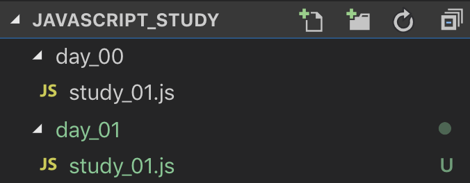
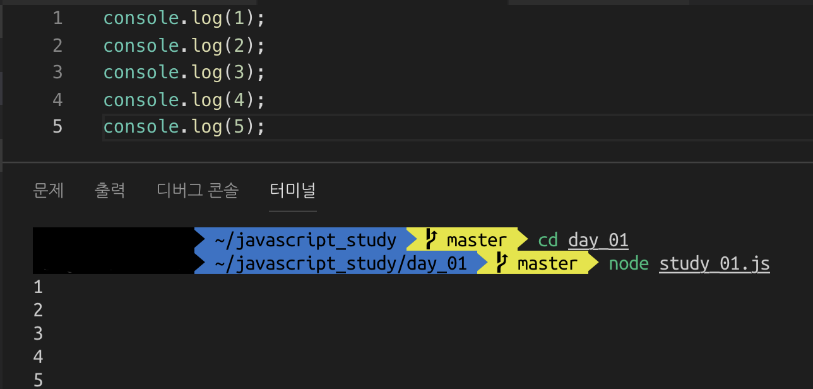

## 자바스크립트의 숫자와 문자
자바스크립트에는 숫자, 문자 외에도 ES6에서 추가된 심볼 타입까지 총 7가지 자료형이 있다. \
그중 이번엔 **숫자**와 **문자** 자료형을 알아보자. \
 

 
VSCode를 열고 **day\_01** 폴더를 만든 뒤 그 안에 저번과 똑같이 **study\_01.js** 파일을 생성하자. \
그다음 **study\_01.js** 에 밑에와 같이 코드를 작성한다.
~~~javascript
console.log(1);
console.log(2);
console.log(3);
console.log(4);
console.log(5);
~~~
작성이 완료되었다면 터미널을 열고 예제와 같이 **day\_01** 폴더로 이동한 다음 **node study\_01.js** 명령어로 출력이 제대로 되는지 확인해본다. \
 

 
여러분은 방금 훌륭하게 숫자 자료타입을 사용하였다. \
자바스크립트를 포함한 대부분의 프로그래밍 언어는 여러분들이 알고 있는 수학 연산자 기호를 사용할 수 있다. \
이번에는 조금 더 응용하여 숫자를 연산해보자. \
study\_02.js 파일을 만들고 밑의 코드를 작성한다.
~~~javascript
console.log(1 + 1.2423);
console.log(2 - 91029) ;
console.log(22 / 7);
console.log(10101010 * 202024920);
~~~
이번엔 터미널에 **node study\_02.js** 명령어를 입력한다.
~~~console
node study_02.js
2.2423
-91027
3.142857142857143
2040655737169200
~~~
위와 같이 결과가 출력되었다면 성공이다! \
이제 여러분은 완벽하게 **숫자**를 배웠다! \
더 이상 덧셈 뺄셈을 할 때에 열 개 밖에 없는 손가락을 사용하지 않아도 자바스크립트가 도와주니 세상이 참 편해진 걸 느낄 수 있을 것이다! \
 
이번에는 **문자**를 배워볼 것이다! \
여러분들은 이미 저번 시간에 문자열을 출력했다! \
문자열은 아래와 같이 **'** 또는 **"** 으로 감싸 표현한다.
~~~javascript
"문자열 표현 방법 1"
'문자열 표현 방법 2'
~~~
ES6 부터는 템플릿 리터럴(**Template literal**) 이라는 새로운 문자열 표기법이 도입되었다. \
**`** 로 문자열을 감싸여 표현하며 **${}** 을 사용하여 내부에 자바스크립트 코드를 넣을 수 있다. \
템플릿 리터럴의 편의성은 이 말고도 훨씬 많지만 여기서는 이 정도만 알고 넘어가도록 하자.
~~~javascript
`문자열 표현 방법 ${1+2}`
~~~
**study\_03.js** 파일을 생성하여 밑의 코드를 작성해보자.
~~~javascript
console.log('9' + '1');
console.log(1 + '9');
console.log('1' + 9);
console.log('10' - '1');
console.log('10' - 1);
console.log('10' * 10);
console.log('10' / 5);
~~~
이제 터미널에서 **node study\_03.js** 명령어를 입력하여 결과를 확인해보자!
~~~console
node study_03.js
91
19
19
9
9
100
2
~~~
문자열과 숫자를 연산하였는데, 결과가 생각지도 못하게 출력되었다! \
자바스크립트에서 **+** 연산은 연산자 앞 또는 뒤에 문자열이 하나라도 위치해 있다면 양쪽 다 ***문자열로 판단하여***  합쳐진 문자열이 반환된다. \
그러나 그 외에 산수 연산자 **- * \\** 는 문자열이 있더라도, 혹은 양쪽 다 문자열일지라도 숫자로 인식하여 연산의 결과가 반환된다. \
 
자바스크립트에는 자료형의 타입을 알 수 있는 **typeof** 연산자가 있다. \
**study\_04.js** 를 만들고 밑의 코드를 작성해보자.
~~~javascript
console.log(typeof('9' + '1'));
console.log(typeof(1 + '9'));
console.log(typeof('10' - '1'));
console.log(typeof('10' - 1));
console.log(typeof('10' * 10));
console.log(typeof('10' / 5));
~~~
**typeof** 연산자는 뒤에 오는 값의 자료형을 문자열로 반환해준다. \
문자라면 ***string*** \
숫자라면 ***number*** \
**study\_04.js** 를 실행하기 전 어떤 결과가 나올지 생각해본 다음 코드를 실행시켜보자!
~~~console
node study_04.js
string
string
number
number
number
number
~~~
자바스크립트에는 문자열을 숫자로 바꾸는 방법도 존재한다! \
***parseInt()*** 함수와 ***Number()*** 넘버 클래스를 이용하는 방법이 있다! \
 
**study\_05.js** 를 만들고 밑의 코드를 작성하고 실행해보자!
~~~javascript
console.log(typeof Number('10')); // Number의 첫번째 N은 대문자입니다! 주의하세요!
console.log(typeof parseInt('10')); // parseInt의 중간에 들어가는 I는 대문자입니다! 주의하세요!
~~~
~~~console
node study_05.js
number
number
~~~
만약 응용력이 뛰어난 사람이라면 위의 방법이 아니라도 문자열 '10'을 숫자로 바꿀 수 있다!
~~~javascript
console.log(typeof('10'-0)); // number
~~~
무려 0을 빼버리는 방법이 있었다! 하지만 코드의 가독성이 떨어지며 사용하기에 좋은 방법이 아니다! \
 
만약 숫자와 문자가 합쳐진 문자열이라면 어떻게 하는 게 좋을까? \
**study\_06.js** 를 만들고 밑의 코드를 작성해보자!
~~~javascript
console.log(parseInt('1020가나다라9999'));
console.log(parseInt('가나123다라'));
console.log(Number('1020가나다라9999'));
~~~
과연 ***10209999*** 와 ***123*** 이 제대로 반환될까? \
코드를 실행해보자!
~~~console
node study_06.js
1020
NaN
NaN
~~~
예상과는 다른 결과가 반환되었다! \
 
위에서부터 설명하자면 ***parseInt()*** 함수는 숫자와 문자가 섞여있는 문자열을 집어넣을 경우 문자열의 맨 앞에서부터 숫자가 있는지 판별 후 숫자가 나오지 않을 때까지 문자열의 숫자를 반환한다! \
 
***'1020가나다라9999'*** 를 집어넣어 문자열의 맨 앞이 **1**인걸 확인하여 **가나다라** 가 나오기 전 **1020**까지의 숫자를 반환하였다! \
***'가나123다라'*** 를 집어넣었을땐 문자열의 맨 앞이 숫자가 아니기 때문에 **NaN(Not a Number)** 가 반환되었다! \
***Number()*** 넘버 클래스를 이용한 방법은 숫자만 있는 문자열이 아니라면 **NaN** 이 반환된다! \
 
**NaN** 은 숫자가 아니라는 의미지만, **typeof** 연산자로 확인할 경우 **number**가 반환된다!
~~~javascript
console.log(typeof NaN); // number
console.log(isNaN(NaN)); // true
console.log(isNaN(32)); // false
~~~
**NaN** 을 판별하는 방법은 ***isNaN()*** 함수를 이용하는 것이다! \
반환값으로 **ture** / **false** 라는 **불리언(boolean)** 자료형이 반환되는데, 이는 다음에 배우기로 한다! \
 
###마지막으로 이번에 배운걸 복습해보자!
**study\_07.js** 를 만들고 밑의 코드를 작성해보자!
~~~javascript
console.log('2'+'13'); // 213
console.log('10'*2+'5'); // 205
console.log('62개'-27); // NaN
~~~
**study\_07.js** 를 실행시켰을 때 밑의 결과가 나오도록 여러분이 직접 코드를 수정해보자!
~~~console
node study_07.js
15
25
35
~~~
**정답은 포스트의 맨 밑에 올려두었다! 만약 위의 문제가 어렵거나 방법을 잘 모르겠다면 맨 위부터 다시 한번 복습해보자!** \
 

###모든 예제 코드는 https://github.com/smokerJS/javascript_study 에서 무료로 열람이 가능합니다! 세상에나!

 
 
 

**정답코드**
~~~javascript
console.log(Number('2')+Number('13')); // 15
console.log('10'*2+Number('5')); // 25
console.log(parseInt('62개')-27); // 35
~~~
개발에는 정답이 없습니다! 여러분만의 방법으로 같은 결과를 출력하여도 좋습니다!