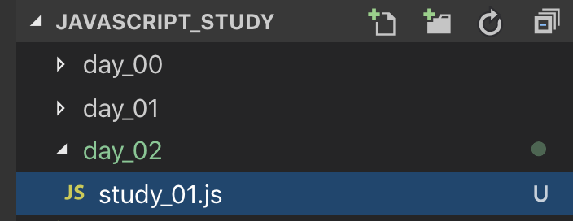

## 자바스크립트의 변수
자바스크립트에는 var let const 총 세 가지의 변수 선언 키워드가 있으며, 이번 포스트에서는 var 키워드의 사용방법을 알아본다. \
자바스크립트는 C와 Java 등과 달리 동적으로 변수 타입을 할당하며, 또한 그에 필요한 메모리 공간을 명시적으로 선언하지 않아도 된다. \
이게 무슨 소리냐면 입문하기 쉽고 겁나 편한데 뭔가 문제가 있다는 것...
~~~javascript
var temp1 = 0;
let temp2 = '문자열';
const temp3 = [];
~~~
 

## 변수가 필요한 이유는?
만약 손님이 왔을 때 손님에게 인사를 하는 프로그램을 작성한다고 생각해보자. \
인사멘트는 **"후론투엔두 입니다! 안녕하세요!"** \
손님이 퇴장할 때엔 **"후론투엔두 입니다! 안녕히 가세요!"**
~~~javascript
console.log('후론투엔두 입니다! 안녕하세요!');
console.log('후론투엔두 입니다! 안녕히 가세요!');
~~~
그런데 내 블로그의 이름 **"후론투엔두"** 가 어떠한 사유로 **"꾸에에엙"** 으로 바뀌었다! \
그렇다면 여러분들이 빨리 코드를 수정하여 인사 멘트를 바꿔야 한다.
~~~javascript
console.log('꾸에에엙 입니다! 안녕하세요!');
console.log('꾸에에엙 입니다! 안녕히 가세요!');
~~~
그런데 또 블로그의 이름이 바뀐다면? \
여러분들은 지속적으로 **블로그 이름이 들어간 곳에 모든 문구를 수시로 바꿔주어야 할 것이다.** \
만약 중간에 차마 바꿔주지 못한 문자열은 새로 바뀐 멘트가 적용되지 못하고, 기존과 같은 인사멘트를 출력하여 사용자의 혼란을 초래하게 된다! \
 
### 하지만 변수를 사용한다면?
~~~javascript
const BLOG_NAME = '후론투엔두';
console.log(`${BLOG_NAME} 입니다! 안녕하세요!`);
console.log(`${BLOG_NAME} 입니다! 안녕히 가세요!`);
~~~
위의 코드는 추후 배울 **const** 키워드를 이용하여 변수를 선언하고, 저번에 배운 **템플릿 리터럴**을 사용하여 문자열을 만들어 낸 뒤 출력하는 코드이다. \
맨 위의 **BLOG_NAME**이라고 선언된 변수의 값을 바꿔주면 여러 줄(***line***)의 코드를 수정하지 않아도 되며, \
다른 개발자가 여러분들의 코드를 보았을 때 '후론투엔두' 라는 문자열이 블로그의 이름인 것을 **변수명**을 통하여 예상할 수 있게 된다. \
**즉 변수를 사용하는 이유는 중복되어 사용하는 값을 미리 선언하여 개발 단계에서 생산성을 증가시키며 유지 보수에 도움을 주고 가독성이 더 좋아지는 효과가 있기 때문이다!** \
 

## var 키워드를 이용한 변수 선언
ES6 이전 javascript 에서는 var 키워드를 사용하여 변수 선언을 해야 했다. \
var 키워드는 설계상 오류에 주의를 기울이지 않으면 심각한 문제를 일으킨다.

1. **변수 호이스팅**\
  -변수를 선언하기 전에 참조가 가능하다.
2. **중복 선언 허용**\
  -의도하지 않은 변수값 변경
3. **함수 레벨 스코프**\
  -전역 변수의 남발\
  -for loop 초기화식에서 사용한 변수를 for loop 외부 또는 전역에서 참조할 수 있다.
4. **var 키워드 생략 허용**\
  -의도하지 않은 변수의 전역화

사실 이렇게 써 놓아도 이해하기 힘들다. \
일단 써보도록 하자 \
 

 

VSCode를 열어 여러분의 프로젝트에 **day_02** 폴더를 만들고 **study\_01.js** 파일을 생성하자. \
밑의 예제를 작성한 뒤 실행 결과가 어떨지 생각해보자!

~~~javascript
console.log(test)

var test = '첫번째 test';
console.log(test);

var test = '두번째 test';
console.log(test);
~~~
사실 프로그래밍을 정말 처음 배우는 사람들이 아니라면 위의 코드가 굉장히 문제가 있다는 것을 미리 인지하였을 것이다. \
코드를 한번 실행해보자!
~~~console
node study_01.js
undefined
첫번째 test
두번째 test
~~~
걱정과 달리 아무 문제없이 실행이 된다! 위의 예제는 **var** 키워드의 **문제점**을 갖고 있는 코드이다. \
우선 **var** 키워드의 **문제점**을 하나씩 설명해보겠다. \
 

### 변수 호이스팅 (hoisting)
자바스크립트는 변수 선언의 호이스팅(***hoisting***) 이라는 특징이 있다. \
모든 변수 선언을 코드의 최상단으로 가져와 해석하며, 그 이후 변수에 값을 할당하는 위치에서 값을 갖게 된다. \
**study\_01.js**의 코드는 사실 자바스크립트가 해석하기에 이러한 코드가 된다.
~~~javascript
var test;

console.log(test)

test = '첫번째 test';
console.log(test);

test = '두번째 test';
console.log(test);
~~~
즉 변수의 호이스팅으로 인하여 맨 첫 번째로 test를 호출했을 때 코드상 변수가 선언되지 않았으나 호출(**참조**)이 가능하였으며, \
그 값은 값을 할당하지 않았다는 ***undefined*** 가 되었다. \
이후 test에 "첫번째 test"라는 값을 할당하여 의도한 문자열이 출력되었다.

변수를 선언하는 단계를 **변수의 선언** 이라 하며, \
변수에 값을 처음으로 할당하는 단계를 **변수의 초기화** 라고 하는데, \
**자바스크립트**는 호이스팅으로 인하여 내부적으로 변수의 **선언**과 **초기화**가 **동시에 이루어지지 않는 언어이다.** \
 

### 변수 중복선언
**study\_01.js** 코드를 보면 "첫번째 test"라는 값을 할당하기 위하여 변수를 선언하고, \
바로 밑에 "두번째 test" 라는 값을 할당할 때 다시 한번 var 키워드로 변수를 선언하였다.

C, Java 등의 언어에서는 같은 이름인 변수의 중복 선언이 불가능한데, 자바스크립트의 var 키워드는 중복 선언을 허용한다. \
이 또한 문제점이 될 가능성이 많다. 만약 여러분들이 이미 var 키워드로 변수를 선언하였는데, \
다른 사람이 이미 선언된 변수인지 모르고 같은 이름의 변수를 선언할 경우 에러문구 하나 없이 변수가 바뀌게 되는 것이다.
~~~javascript
var item = '사탕';
var price = 500;
console.log(`${item}의 가격은 ${price}원 입니다.`);
.
.
.
var price = 700;
var amount = 7;
console.log(`${item}을 ${amount}개 주문하셨습니다! 총 가격은 ${price*amount}원 입니다.`);
~~~
~~~console
사탕의 가격은 500원 입니다.
.
.
.
사탕을 7개 주문하셨습니다! 총 가격은 4900원 입니다.
~~~
내가 선언한 사탕의 가격은 500원인데, 누군가 사탕의 가격을 700원으로 또 선언하여 사용자는 처음 안내받은 가격보다 더 많은 가격을 지불하게 되었다. \
즉, 아무런 에러문구 하나 없이 위처럼 중복 선언이 허용되어 코드가 잘못된 방향으로 짜여도 확인하기 어려운 문제가 생긴다. \
 

### 함수레벨 스코프
이 특징은 아직 여러분이 배우기에 굉장히 난해한 이론이 포함된다. \
**study\_02.js** 를 생성하여 밑의 예제를 작성하고 바로 실행해보자.
~~~javascript
var test = 'test1 변수';
console.log(test);  // 1

function testFunction() {
  console.log(test);  // 2
  var test = 'test2 변수';
  console.log(test);  // 3
}

testFunction();
console.log(test);  // 4
~~~
~~~console
node study_02.js
test1 변수
undefined
test2 변수
test1 변수
~~~
총 4번의 출력을 실행하였다. \
1번 출력에서는 예상대로 'test1 변수' 가 출력되었다.

2번 출력과 3번 출력은 **함수** 내부에서 실행되는 코드이다. \
미리 전역변수로 test 가 선언되었음에도 불구하고, 함수 내부에서 **test**를 ***var*** 키워드를 사용하여 다시 선언하였다. \
이로 인하여 함수 내부에서 **호이스팅이 다시 발생하여** 2번 출력은 값이 할당되지 않는 **undefined** 가 출력되었고, \
3번 출력은 'test2 변수'를 할당받은 test가 출력되었다.
~~~javascript
function testFunction() {
  var test;
  console.log(test); // undefined
  test = 'test2 변수';
  console.log(test) // test2 변수
}
// 함수레벨 스코프의 특징으로 호이스팅이 함수 내부에서 발생하여 위와 같은 코드가 되었다.
~~~
 

그렇다면 4번 출력은 왜 'test1 변수' 가 출력되었을까? \
함수 내부에서 값을 바꿨음에도 불구하고 var 키워드가 **함수레벨 스코프**를 갖고있어서 **함수 외부의 test에 영향을 미치지 못한 것이다.**

혹시 그럼 블록 단위에서 var 키워드를 사용한다면 어떨까? \
**study\_03.js** 를 생성하여 밑의 예제를 작성하고 바로 실행해보자.
~~~javascript
var test = 'test1 변수';
console.log(test);  // 1

{
  console.log(test);  // 2
  var test = 'test2 변수';
  console.log(test);  // 3
}

console.log(test);  // 4
~~~
~~~console
node study_03.js
test1 변수
test1 변수
test2 변수
test2 변수
~~~
1번 출력은 예상과 같이 'test1 변수' 가 출력되었다. \
2번 출력과 3번 출력은 블록 레벨에서 실행된 코드임에도 불구하고 블록 밖의 test를 참조하여 \
2번 출력은 'test1 변수' 가 출력되었고, 3번 출력은 2번 출력 이후 test에 할당한 'test2 변수'가 출력되었다. \
블록을 탈출한 이후 4번 출력 또한 3번 출력과 같은 'test2 변수'를 출력하였다.
~~~javascript
var test;
test = 'test1 변수';
console.log(test);  // 1
{
  console.log(test);  // 2
  test = 'test2 변수';
  console.log(test);  // 3
}
console.log(test);  // 4
// 실제 자바스크립트가 실행되는 코드는 이러한 형식이다.
~~~

보통의 프로그래밍 언어는 함수레벨 스코프가 아닌, 블록레벨 스코프를 기본으로 한다. \
**ES6**에서 나온 **let**과 **const** 키워드는 **블록레벨**의 스코프를 기본으로 하는 키워드지만, \
**var** 키워드는 **함수레벨** 스코프를 기본으로 하는 키워드이기 때문에 사용 시 **프로그램의 설계에 굉장히 주의가 필요하다.** \
 

### var 키워드 생략 허용
**study\_04.js** 를 만들고, 밑의 코드를 작성하고 실행해보자.
~~~javascript
function testFunction() {
  test = '함수레벨 지역변수';
  console.log(test);
  a = 'a';
  console.log(a);
}
testFunction()

console.log(test);
console.log(a);
~~~
~~~console
node study_04.js
함수레벨 지역변수
a
함수레벨 지역변수
a
~~~
우선, 자바스크립트는 var 키워드를 생략하더라도 변수의 선언이 가능하다. \
위의 코드는 함수 내부에서 var 키워드 없이 test 와 a 변수를 선언한 뒤 출력하였고, \
함수를 탈출한 다음에도 여전히 변수가 호출되어 동일한 문자열을 출력하는 예제이다.

var 키워드를 사용했다면, 함수 밖에서 호출한 test를 출력할 때 에러가 나와 코드가 정상적으로 실행이 되지 않았을 테지만, \
아무 키워드 없이 함수 내부에서 변수를 선언할 경우 해당 변수는 **전역변수**가 되어 함수 밖에서도 호출(***참조***)이 가능해진다. \
이를 **의도치 않은 변수의 전역화**라고 하며, 키워드 없이 변수 선언이 가능한 **자바스크립트의 특징**인 동시에 **사용하지 말아야 할 단점**이기도 하다. \
 

## var 키워드를 왜 배운거야?
var 키워드의 문제점은 위의 예제 이외에도 더 많으며, 오늘 예제는 var 키워드의 대표적인 특징과 자바스크립트의 호이스팅에 관하여 다룬 예제이다. \
ES6부터는 var 키워드 사용을 중단하고 let 과 const 키워드만을 사용하길 권장한다. \
var 키워드를 아예 사용하지 않아야 하는것은 아니지만, \
함수레벨 스코프의 예상치 못한 설계오류와 var 키워드로 구현이 가능한 프로그램은 전부 let과 const 키워드로 구현이 가능하기 때문이다. \
오늘 var 키워드를 배운 이유는 아직까지 많은 회사에서 ES6가 아닌 ES5를 사용하기도 하며, 추후 나올 클로저(closer) 문법을 배우기 위함이다.

다음 포스트는 let과 const 키워드를 다룰 예정이니 오늘은 변수 선언의 방법과, 변수를 사용해야 하는 이유만 알고 넘어가도록 하자. \
 

###모든 예제 코드는 https://github.com/smokerJS/javascript_study 에서 무료로 열람이 가능합니다! 세상에나!