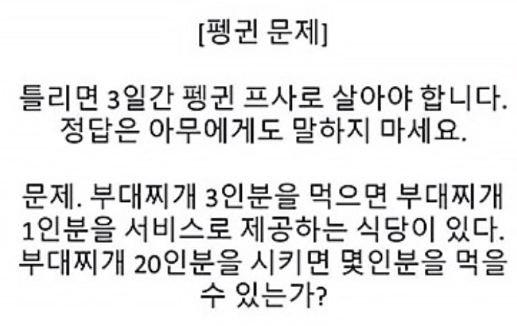

## 요즘 인싸들이 풀고있다는 펭귄문제!

 
인싸들 사이에서 유행인 이 문제 \
언뜻 보면 3인분 주문 시 1인분 서비스인 듯 보여 **"26인분!"** 이라고 대답을 할지도 모른다. \
하지만 문제를 잘 살펴보면 ***3인분을 먹을 때마다 1인분을 서비스*** 로 준다는 문제이다.

간단한 알고리즘이니 한번 자바스크립트 코드로 풀어보자!

~~~javascript
let order = 20; // 주문한 음식의 수
let eatFood = 0;  // 먹은 음식의 수
let count = 3;  // 서비스 음식을 받기위해 세는 카운트

while(order) {  // 남은 주문이 없을때까지 반복문을 돌린다.
  eatFood++; // 음식이 나와 먹은 수를 누적시킨다.
  count--;  // 음식을 한번 먹을때 서비스가 나올때까지 얼마나 남았는지 누적시킨다.
  !count ? count = 3 : order--;
  // 서비스가 나올 차례인지 확인하고 만약 나오면다면 다시 서비스 카운트를 초기화 시킨다.
  // 그게 아니라면 다음에 나와야 할 음식을 주문수에서 뺀다.
}
console.log(eatFood);
~~~
~~~console
29
~~~

너무나 간단하게 문제가 풀렸다! \
그리고 현시각 나의 프로필 사진은...

정답은 ***아무에게도 말하지 마세요.*** \
세상은 뭔가 잘못되어있다..